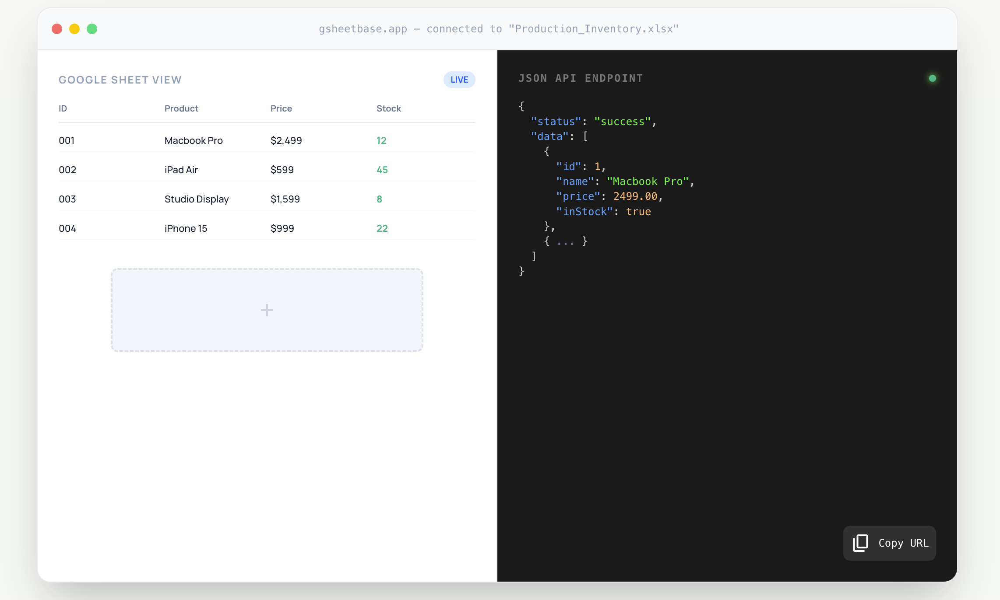

  

<h1 align="center">
  🔑 Gsheetbase
</h1>

  Transform your Google Sheets into REST APIs in seconds. Sign in, select sheets, get instant public or private API endpoints.

  Built with Go, React, PostgreSQL, and Google OAuth. Privacy-first, zero data storage.

 

## Features

Gsheetbase makes it simple to convert any Google Sheet into a production-ready REST API. No data storage, no complicated setup.

### 🔐 Authentication & Security
- Sign in with Google OAuth (no passwords)
- Read-only Google Sheets API access
- API keys for public/private endpoints
- User control over exposed sheets

### 📊 Sheet API Management
- Whitelist exactly which sheets to expose
- Instant REST API generation
- Clean, structured JSON responses
- Zero data stored in database

### ⚡ Built for Performance
- Real-time data fetching
- Redis caching (optional)
- Lightweight and stateless
- Horizontally scalable workers

## Contribution Policy

Gsheetbase is open source but currently only accepting contributions for **bug fixes**. To get started, visit [DEVELOPMENT.md](./DEVELOPMENT.md) for tips on setting up your environment.

### How to Report a Bug

1. **Search existing issues** to avoid duplicates
2. **Open a new issue** with:
   - Clear description of the bug
   - Steps to reproduce
   - Expected vs actual behavior
3. **Include environment details** (OS, Go/Node version, database version)

## Useful Resources

- [Documentation](https://www.gsheetbase.com/docs)
## License

Gsheetbase is released under the MIT License. See [LICENSE](./LICENSE) for details.
